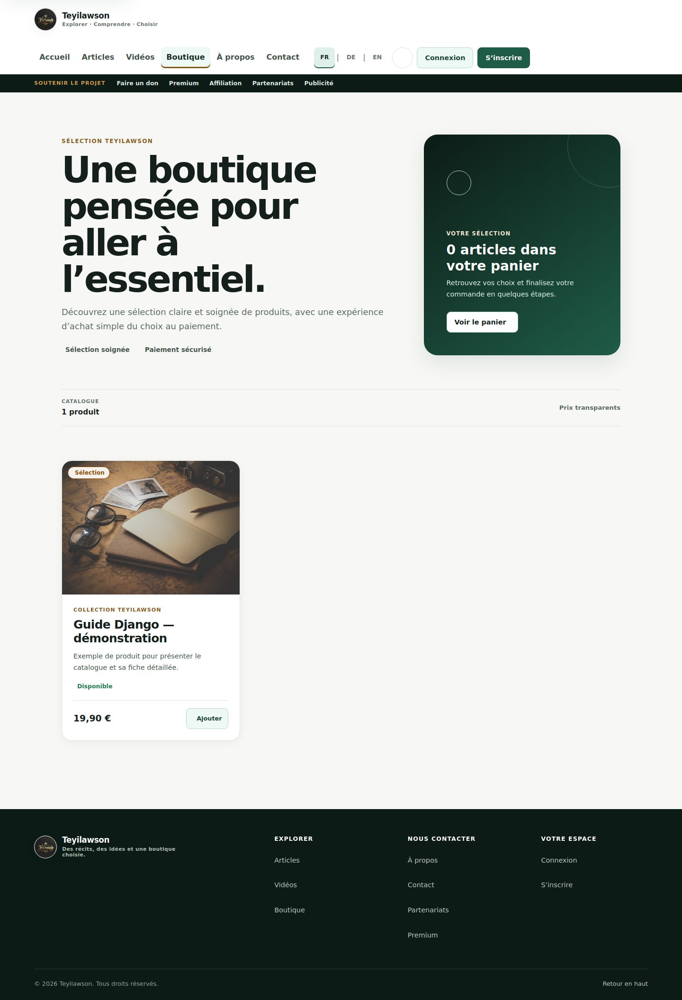
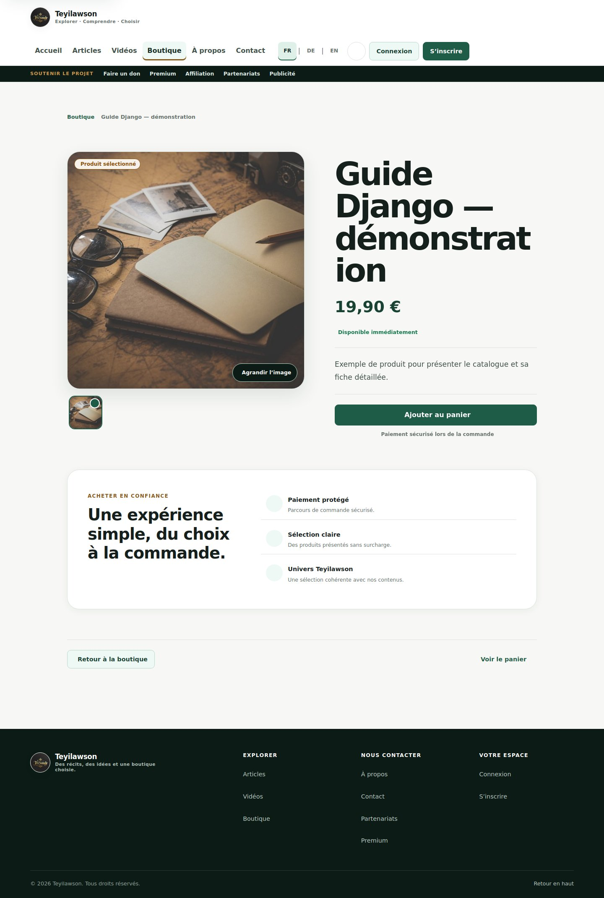

# Django Blog & Shop

Persönliches Entwicklungsprojekt von **Teyi Guillaume Lawson-Somadje**: eine mehrsprachige Webanwendung, die redaktionelle Inhalte mit einem Produktkatalog und Bestellabläufen verbindet.

Das Projekt zeigt praktische Arbeit mit Python und Django: Datenmodellierung, Authentifizierung, Zugriffsschutz, Shop-Funktionen, Tests und Deployment-Konfiguration.

## Einblicke

Die folgenden Screenshots zeigen eine lokale Entwicklungsinstanz mit fiktiven Demonstrationsdaten. Sie sind keine Darstellung realer Kunden oder Transaktionen.

### Startseite


### Produktkatalog



### Produktdetail



## Funktionen

- **Blog:** Artikel, Kategorien, Bilder und hervorgehobene Inhalte.
- **Shop:** Produktkatalog, Produktdetails, Warenkorb, Checkout und Bestellbestätigung.
- **Kundenbereich:** eigene Bestellungen und zugehörige Detailseiten.
- **Verwaltung:** Produkte, Kategorien, Inventar und Bestellungen.
- **Benutzerkonten:** eigener Benutzer-Typ und Authentifizierung.
- **Premium-Inhalte:** Zugriffskontrolle für geschützte Artikel.
- **Internationalisierung:** Französisch, Deutsch und Englisch.
- **Monetarisierung:** Bereiche für Abonnements, Werbung, Partnerschaften und Affiliate-Anfragen.
- **SEO:** Sitemap und robots.txt.

Zahlungsintegration und tatsächliche Zahlungsbereitschaft sind zu unterscheiden: Stripe- und CinetPay-Code sowie Konfigurationsschalter sind vorhanden. Die Aktivierung hängt von gültigen Zugangsdaten, Webhooks und Tests ab. Dieses README bestätigt keine produktiven Zahlungen; PayPal wird nicht als fertig integrierter Anbieter ausgewiesen.

## Technologie

| Bereich | Umsetzung |
| --- | --- |
| Backend | Python, Django 5.2 |
| Oberfläche | Django-Templates, HTML, CSS, Bootstrap, JavaScript |
| Datenbank | SQLite lokal; PostgreSQL über DATABASE_URL |
| Übersetzung | Django i18n und django-modeltranslation |
| Medien | Lokale Dateien in Entwicklung; Cloudinary in Produktion |
| Statische Dateien | WhiteNoise |
| Deployment | Gunicorn, Render-Konfiguration |
| Zusammenarbeit | Git, GitHub und Pull Requests |

## Projektstruktur

| Verzeichnis | Aufgabe |
| --- | --- |
| blog/ | Einstellungen, globale URLs, Startseite und SEO |
| accounts/ | Benutzerkonten |
| articles/ | Redaktionelle Inhalte |
| shop/ | Produkte, Warenkorb, Inventar und Bestellungen |
| payments/ | Zahlungsabläufe und Zahlungsintegrationen |
| monetization/ | Premium-Angebote, Werbung und Partnerschaften |
| videos/ und social/ | Video- und soziale Funktionen |
| templates/, static/ | Oberfläche und statische Ressourcen |

## Lokal starten

Die folgenden Befehle sind für Bash unter Linux, macOS oder WSL vorgesehen.

```bash
git clone https://github.com/teyi12/my_blog.git
cd my_blog
python3 -m venv .venv
source .venv/bin/activate
python -m pip install -r requirements.txt
```

Für eine lokale SQLite-Instanz eine Datei .env im Projektverzeichnis anlegen:

```dotenv
ENVIRONMENT=development
DEBUG=True
SECRET_KEY=replace-with-a-random-local-secret
ALLOWED_HOSTS=127.0.0.1,localhost
SITE_BASE_URL=http://127.0.0.1:8800
STRIPE_ENABLED=False
CINETPAY_ENABLED=False
DONATIONS_ENABLED=False
SUBSCRIPTIONS_ENABLED=False
```

DATABASE_URL für SQLite nicht setzen. Eigene Zugangsdaten gehören ausschließlich in die lokale Umgebung; die .env-Datei nicht committen.

```bash
python manage.py migrate
python manage.py createsuperuser
python manage.py runserver 127.0.0.1:8800
```

- Startseite: http://127.0.0.1:8800/
- Shop: http://127.0.0.1:8800/shop/
- Administration: http://127.0.0.1:8800/admin/

Die Datenbank ist nach dem Start leer. Artikel und Produkte können über die Administration erstellt werden. Zahlungs- und E-Mail-Funktionen benötigen zusätzliche Konfiguration.

## Prüfung und Tests

```bash
python manage.py check
python manage.py test
```

Tests liegen in den jeweiligen Apps. Sie behandeln unter anderem Berechtigungen, Premium-Zugriff, Warenkorb-, Bestell- und Zahlungsabläufe. Die oben genannten Befehle sind Prüfungsanweisungen; dieses README behauptet keinen aktuellen vollständigen Testlauf.

## Hinweise für Produktion

Die Einstellungen unterscheiden zwischen Entwicklung und Produktion. In Produktion werden unter anderem SECRET_KEY, erlaubte Hosts, eine öffentliche HTTPS-Basis-URL, PostgreSQL und Cloudinary-Zugangsdaten benötigt. HTTPS-Weiterleitungen und sichere Cookies werden dort aktiviert.

Der Entwicklungsserver ist für lokale Arbeit vorgesehen. Für ein Deployment sind zusätzlich statische Dateien, Migrationen, E-Mail-Konfiguration und gegebenenfalls Zahlungs-Webhooks zu prüfen.

## Autor

**Teyi Guillaume Lawson-Somadje** · Fachinformatiker für Anwendungsentwicklung · Junior Python-/Django-Entwickler

- [GitHub-Profil](https://github.com/teyi12)
- [LinkedIn](https://www.linkedin.com/in/teyi-guillaume-lawson-somadje-5706a4193/)
- [Lebenslauf](https://teyi12.github.io/mein-lebenslauf/)
